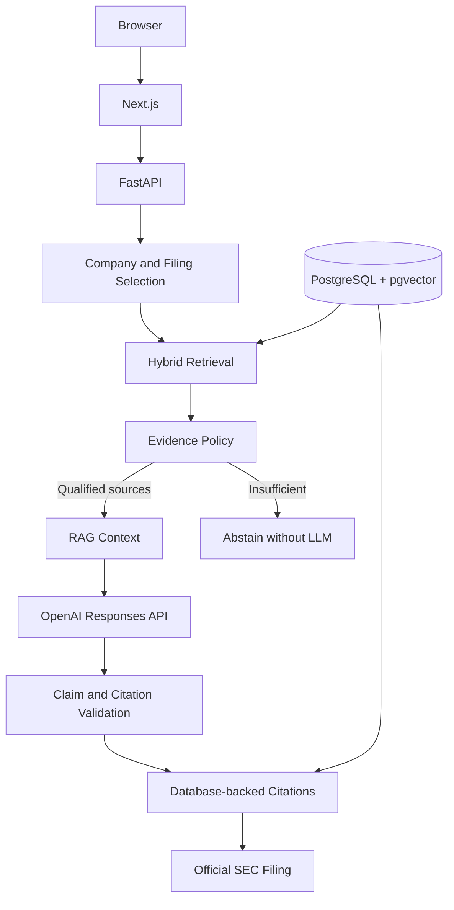
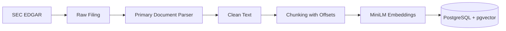

# FinLens

FinLens is an evidence-grounded financial research platform that lets users explore public-company SEC filings, ask financial questions, and trace answers back to official SEC evidence.

A student engineering project focused on inspectable financial answers. The scope is local, single-filing research, not investment advice.

## Project overview, motivation, and problem

SEC filings contain useful evidence, but reading them involves long documents, inconsistent XBRL concepts, fiscal periods, and tables. Generated answers can confuse periods, invent causes, or cite unrelated passages. FinLens separates data preparation, retrieval, evidence selection, generation, and citation validation. Users choose a company and an indexed filing before asking a question. The goal is traceable answers and explicit abstention.

## Project documentation

The current demo is a foundation for a broader Research Mode that remains useful without an LLM; AI Analysis is an optional enhancement. Planned capabilities are distinct from the recorded implementation and acceptance results below.

- [Roadmap and milestone status](ROADMAP.md)
- [Product specification](docs/product-spec.md) and [AI-is-optional decision](docs/decisions/003-ai-is-optional.md)
- [Current architecture](docs/architecture.md) and [technical challenges](docs/technical-challenges.md)
- [Engineering standards](docs/engineering-standards.md) and [data-source policy](docs/data-sources.md)
- [Repository instructions](AGENTS.md) and [ExecPlan standard](.agent/PLANS.md)

## Quick Start

Windows PowerShell is the supported walkthrough. Install **Git, Python, Node.js/npm, and Docker Desktop** first; start Docker Desktop and wait until its engine is ready. PostgreSQL runs in Docker—no separate PostgreSQL installation is needed. First setup needs internet access for dependencies, SEC data, and the MiniLM model.

### 1. Clone and configure

```powershell
git clone https://github.com/alaniong0118-alt/finlens.git
cd finlens
Copy-Item .env.example .env
Copy-Item backend/.env.example backend/.env
Copy-Item frontend/.env.example frontend/.env.local
```

Copy examples only on a fresh clone; preserve existing configured files. Edit the private files with your editor:

| File | Required value |
|---|---|
| `.env` | `POSTGRES_PASSWORD`: choose a local database password |
| `backend/.env` | `DATABASE_URL`: `postgresql+psycopg://finlens:<URL-encoded-password>@127.0.0.1:5432/finlens`, using the same password |
| `backend/.env` | `SEC_CONTACT_EMAIL`: your real contact email for the SEC User-Agent |
| `frontend/.env.local` | Keep `FINLENS_API_BASE_URL=http://127.0.0.1:8000` |

Replace the angle-bracket placeholder; do not paste it literally. URL-encode special characters in the database URL password (the root password is the original, unencoded value). Existing PostgreSQL volumes retain their original password: changing an env file does not change a database user's password.

**OpenAI API key is only required for live generated answers.** Leave `OPENAI_API_KEY` blank for setup, company/filing selection, retrieval, context, and insufficient-evidence responses. Optional model/effort fields do not affect demo preparation. Never put backend credentials in frontend configuration.

### 2. Prepare the demo and start the backend

From the repository root:

```powershell
docker compose up -d postgres
docker compose ps
cd backend
py -m venv .venv
.\.venv\Scripts\python.exe -m pip install -r requirements-dev.txt
.\.venv\Scripts\python.exe -m alembic upgrade head
.\.venv\Scripts\python.exe -m scripts.setup_demo
.\.venv\Scripts\python.exe -m uvicorn app.main:app --host 127.0.0.1 --port 8000
```

Wait for PostgreSQL to report **healthy** before migrations. On a new Docker data directory, the included initialization SQL creates the pgvector extension before Alembic adds vector columns. Existing volumes are retained and are not reinitialized. These commands use the venv executable directly; activation is unnecessary. `requirements-dev.txt` includes the runtime dependencies and pytest for local verification.

`setup_demo` seeds the existing company list, prepares one fixed official Apple 10-Q, and generates local MiniLM embeddings. It prints `status: ready`, the accession, and chunk/embedding counts. The first model download can take time. A repeat run reuses complete data; interrupted embedding work resumes without downloading the SEC filing again. There is no OpenAI call or API charge in this command.

### 3. Start the frontend

In a second PowerShell window, from the repository root:

```powershell
cd frontend
npm ci
npm run dev -- --hostname 127.0.0.1 --port 3000
```

Open **http://127.0.0.1:3000**. Select **AAPL**, then its indexed **10-Q**. The frontend supports selection and question entry without an OpenAI key. A supported generation request will report that the answer service needs a key; it will not fabricate an answer.

To view retrieved evidence without generating an answer, open:

- [Context for revenue growth](http://127.0.0.1:8000/companies/AAPL/filings/0000320193-26-000020/context?q=revenue%20growth&limit=5)
- [API documentation](http://127.0.0.1:8000/docs)

Context/evidence is available through these existing API endpoints; this setup task does not add a new frontend evidence viewer. The question “What clinical trial results did Apple report?” returns insufficient evidence without a model call.

Default ports throughout this walkthrough are **backend 8000 / frontend 3000**. Keep both terminals running. Stop them with Ctrl+C; `docker compose down` stops PostgreSQL while preserving its named volume. Never remove the volume to update the project.

## Key features

- Financial history and filing selection from stored SEC data.
- Primary-document extraction, inline XBRL cleanup, and chunks with offsets.
- Keyword, semantic, and filing-scoped hybrid retrieval.
- Bounded SOURCE blocks, retrieval scores, and structured citations.
- OpenAI Responses API integration with structured output and sanitized errors.
- Insufficient-evidence responses that skip the model.

## System architecture



### SEC data pipeline



Company Facts is a separate structured-data path for revenue, net income, and diluted EPS. See [architecture](docs/architecture.md) and [technical challenges](docs/technical-challenges.md).

## Tech stack

| Area | Components |
|---|---|
| Backend | Python, FastAPI, Pydantic, SQLAlchemy, Alembic, HTTPX, BeautifulSoup |
| Frontend | Next.js, TypeScript, React, Tailwind CSS, Recharts |
| Database | PostgreSQL, pgvector, Docker Compose |
| AI / RAG | sentence-transformers, all-MiniLM-L6-v2, hybrid semantic + lexical retrieval, evidence thresholds, structured citations, OpenAI Responses API |

The recorded acceptance environment used Python 3.14.7, Next.js 15.5.27, pgvector 0.8.7, and 384-dimensional vectors. Dependencies are in `backend/requirements.txt`, `backend/requirements-dev.txt`, and `frontend/package.json`; the npm lockfile is included.

## Hybrid retrieval and evidence policy

Semantic similarity: `S = clamp(1 - cosine distance, 0, 1)`. Lexical score: `L = 0.8 × phrase match + 0.2 × meaningful-term coverage`. Hybrid score: `H = L + 0.6 × S`. These are ranking signals, not probabilities.

The original question is embedded. Limited lexical normalization handles question frames and revenue/net-sales wording. SQL scope uses company CIK and accession. Duplicate identities and identical text are removed in rank order; partial overlap remains intact.

A source qualifies if `L ≥ 0.8`, `S ≥ 0.60`, `S ≥ 0.40 and L ≥ 0.10`, or `L ≥ 0.20 and S ≥ 0.25`. These are heuristics evaluated on one filing. No qualifying evidence means abstention without an OpenAI call.

## RAG design and citation system

`GET /companies/{ticker}/filings/{accession_number}/context?q=...&limit=5` returns bounded context and metadata. Passages have matching SOURCE/END SOURCE boundaries. Input is capped at eight complete blocks and 24,000 characters; the whole filing is not sent.

`POST /companies/{ticker}/filings/{accession_number}/answer` accepts:

```json
{"question": "What drove revenue growth?", "limit": 5}
```

A successful response contains claims and citation IDs. Stored citations retain chunk identity, accession, form, date, filename, offsets, scores, and official SEC URL. The server validates IDs and renders markers; the model cannot supply URLs. Offsets refer to cleaned text. Valid citation identity does **not** prove claim support; each factual claim needs an audit against its actual supplied source.

## Prompt injection defense and financial safety

Questions and filing text are untrusted data beneath a system policy. No model tools are provided. Policy forbids outside facts, unsupported inference, investment recommendations, price targets, and portfolio advice. Server checks reject unknown IDs, malformed source boundaries, generated URLs, and invalid structured output. Deterministic guards reject certain advice requests.

These controls address specific risks; they do not establish universal injection resistance or factual entailment. Mock tests check message separation and validation, not every real response's safety.

## Frontend, backend, and database

- **Frontend:** company/indexed-filing selectors, question entry, loading/error/insufficient states, and answer/citation rendering. Next.js proxies `/api/finlens` to FastAPI.
- **Backend:** financial analysis, SEC parsing/import services, independent search/context APIs, and structured answer generation with explicit errors.
- **Database:** companies, financial facts, and chunks with lineage and `VECTOR(384)` embeddings. Alembic defines the schema.

## Testing and current verification status

These recorded results come from the completed local milestone; they were not rerun merely to prepare this repository.

| Check | Recorded result |
|---|---|
| Backend tests | 41 passed |
| Frontend tests | 6 passed |
| Lint | Passed |
| Production build | Passed |
| Alembic | Clean; no pending schema changes |
| Current AAPL indexed filing | 37 filing chunks and 37 embeddings |
| Citation lineage | Verified against database metadata and official SEC source |
| Live OpenAI integration | Implemented; real SDK requests attempted |
| Full real-LLM claim audit | **Not completed because API credits were unavailable** |

Five real attempts returned application HTTP 502; a diagnostic confirmed provider HTTP 429 / `insufficient_quota` / `credit_balance_exhausted`. No successful real answer or claim audit is claimed. The clinical-trial negative returned insufficient evidence with zero model calls.

See [verification](backend/reports/final_verification.md) and [evaluation](backend/reports/rag_evaluation.json). Reports distinguish real retrieval, mocked provider tests, SDK attempts, and unfinished audits. The MVP is **not fully verified**.

Fresh-clone setup adds 15 orchestration tests; the combined backend run passed **56 tests and 44 subtests**. Empty PostgreSQL initialization/migrations also passed in an isolated temporary container. See [setup verification](backend/reports/setup_demo_verification.json). SEC/model downloads are mocked in unit tests; existing local data was verified twice without downloading it again.

### Test commands

```powershell
cd backend
.\.venv\Scripts\python.exe -m pytest tests -q
# Only with the matching dataset and cached MiniLM:
$env:FINLENS_RUN_DB_TESTS='1'
$env:HF_HUB_OFFLINE='1'
.\.venv\Scripts\python.exe -m pytest tests -q
.\.venv\Scripts\python.exe -m alembic check
```

```powershell
cd frontend
npm test
npm run lint
npm run build
```

Root-level backend `test_*.py` files include exploratory SEC/network scripts; the maintained suite is under `backend/tests`. Billable evaluation requires `python -m scripts.evaluate_rag --real-answers`. Retrieval and mock success are not real answer verification.

## Setup behavior and troubleshooting

The reproducible fixture is official AAPL 10-Q `0000320193-26-000020`, not a dynamically changing latest filing or fabricated data. The recorded local fixture has 37 chunks and 37 embeddings. No database dump is distributed.

- **Complete data:** validate and exit; no SEC request, model loading, or re-ingestion.
- **Missing embeddings:** generate only missing vectors for this filing; retain existing vectors and unrelated data.
- **Missing filing:** fetch its real SEC facts and raw document through existing services, then parse/chunk/embed. If SEC does not return this accession, fail clearly; never substitute another filing.
- **Older custom database without pgvector:** the initialization SQL runs only for new Docker data directories. Have its database owner enable the `vector` extension, then rerun migrations; do not reset the existing volume.
- **Missing schema:** run `python -m alembic upgrade head` from backend; setup does not create/reset tables or migrations.
- **Missing/invalid SEC contact:** set `SEC_CONTACT_EMAIL` in `backend/.env`. It is required before SEC requests. Complete/backfill-only runs need no SEC connection.
- **SEC 403/429 or network failure:** verify your real contact and network access, wait, then rerun. There is no bypass or unlimited retry loop.
- **Model unavailable:** allow the first MiniLM download and sufficient disk space. Do not enable `HF_HUB_OFFLINE` before the model is cached. An interrupted model download can be retried; persisted chunks are reused.
- **Database connection failure:** verify Docker is healthy and the private URL matches the existing database password; do not delete the volume.

See [backend setup details](backend/README.md#reproducible-demo-setup) and [Windows notes](README-WINDOWS.md). Live answers require a private key, an accessible model, and available API credits. Existing `OPENAI_MODEL` / `OPENAI_REASONING_EFFORT` values take precedence over the FINLENS aliases.

## Limitations

- Recorded retrieval validation covers one Apple 10-Q, `0000320193-26-000020`, not general company/period performance.
- No database dump, dependencies, or model cache is distributed; this is not a preloaded hosted demo.
- Lexical ranking scans one filing; larger datasets need indexed candidates.
- Flattened tables and overlap complicate period and numerical-column interpretation.
- Evidence thresholds and valid citations do not guarantee supported claims.
- Real output and full claim entailment remain unverified because credits were unavailable.
- No authentication, deployment hardening, or investment advice is provided.

## Screenshots

Placeholder: add real filing-selection, context, insufficient-evidence, and citation-trace captures. Add an answer screenshot only after a successful real run and audit. No mock screenshot is presented as a live result.

## Future work

Follow the [roadmap](ROADMAP.md) for curated company coverage, normalized financial metrics, complete Research Mode, formal evaluation, optional AI analysis, hardening, and portfolio release. Real LLM acceptance remains pending and will run only when credits are intentionally available; it does not gate work on Research Mode.
