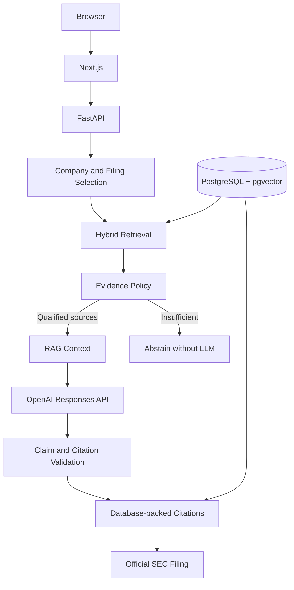
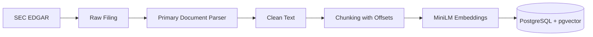

# FinLens

FinLens is an evidence-grounded financial research platform that lets users explore public-company SEC filings, ask financial questions, and trace answers back to official SEC evidence.

A student engineering project focused on inspectable financial answers. The scope is local, single-filing research, not investment advice.

## Project overview, motivation, and problem

SEC filings contain useful evidence, but reading them involves long documents, inconsistent XBRL concepts, fiscal periods, and tables. Generated answers can confuse periods, invent causes, or cite unrelated passages. FinLens separates data preparation, retrieval, evidence selection, generation, and citation validation. Users choose a company and an indexed filing before asking a question. The goal is traceable answers and explicit abstention.

## Key features

- Financial history and filing selection from stored SEC data.
- Primary-document extraction, inline XBRL cleanup, and chunks with offsets.
- Keyword, semantic, and filing-scoped hybrid retrieval.
- Bounded SOURCE blocks, retrieval scores, and structured citations.
- OpenAI Responses API integration with structured output and sanitized errors.
- Insufficient-evidence responses that skip the model.

## System architecture



### SEC data pipeline



Company Facts is a separate structured-data path for revenue, net income, and diluted EPS. See [architecture](docs/architecture.md) and [technical challenges](docs/technical-challenges.md).

## Tech stack

| Area | Components |
|---|---|
| Backend | Python, FastAPI, Pydantic, SQLAlchemy, Alembic, HTTPX, BeautifulSoup |
| Frontend | Next.js, TypeScript, React, Tailwind CSS, Recharts |
| Database | PostgreSQL, pgvector, Docker Compose |
| AI / RAG | sentence-transformers, all-MiniLM-L6-v2, hybrid semantic + lexical retrieval, evidence thresholds, structured citations, OpenAI Responses API |

The recorded acceptance environment used Python 3.14.7, Next.js 15.5.27, pgvector 0.8.7, and 384-dimensional vectors. Dependencies are in `backend/requirements.txt`, `backend/requirements-dev.txt`, and `frontend/package.json`; the npm lockfile is included.

## Hybrid retrieval and evidence policy

Semantic similarity: `S = clamp(1 - cosine distance, 0, 1)`. Lexical score: `L = 0.8 × phrase match + 0.2 × meaningful-term coverage`. Hybrid score: `H = L + 0.6 × S`. These are ranking signals, not probabilities.

The original question is embedded. Limited lexical normalization handles question frames and revenue/net-sales wording. SQL scope uses company CIK and accession. Duplicate identities and identical text are removed in rank order; partial overlap remains intact.

A source qualifies if `L ≥ 0.8`, `S ≥ 0.60`, `S ≥ 0.40 and L ≥ 0.10`, or `L ≥ 0.20 and S ≥ 0.25`. These are heuristics evaluated on one filing. No qualifying evidence means abstention without an OpenAI call.

## RAG design and citation system

`GET /companies/{ticker}/filings/{accession_number}/context?q=...&limit=5` returns bounded context and metadata. Passages have matching SOURCE/END SOURCE boundaries. Input is capped at eight complete blocks and 24,000 characters; the whole filing is not sent.

`POST /companies/{ticker}/filings/{accession_number}/answer` accepts:

```json
{"question": "What drove revenue growth?", "limit": 5}
```

A successful response contains claims and citation IDs. Stored citations retain chunk identity, accession, form, date, filename, offsets, scores, and official SEC URL. The server validates IDs and renders markers; the model cannot supply URLs. Offsets refer to cleaned text. Valid citation identity does **not** prove claim support; each factual claim needs an audit against its actual supplied source.

## Prompt injection defense and financial safety

Questions and filing text are untrusted data beneath a system policy. No model tools are provided. Policy forbids outside facts, unsupported inference, investment recommendations, price targets, and portfolio advice. Server checks reject unknown IDs, malformed source boundaries, generated URLs, and invalid structured output. Deterministic guards reject certain advice requests.

These controls address specific risks; they do not establish universal injection resistance or factual entailment. Mock tests check message separation and validation, not every real response's safety.

## Frontend, backend, and database

- **Frontend:** company/indexed-filing selectors, question entry, loading/error/insufficient states, and answer/citation rendering. Next.js proxies `/api/finlens` to FastAPI.
- **Backend:** financial analysis, SEC parsing/import services, independent search/context APIs, and structured answer generation with explicit errors.
- **Database:** companies, financial facts, and chunks with lineage and `VECTOR(384)` embeddings. Alembic defines the schema.

## Testing and current verification status

These recorded results come from the completed local milestone; they were not rerun merely to prepare this repository.

| Check | Recorded result |
|---|---|
| Backend tests | 41 passed |
| Frontend tests | 6 passed |
| Lint | Passed |
| Production build | Passed |
| Alembic | Clean; no pending schema changes |
| Current AAPL indexed filing | 37 filing chunks and 37 embeddings |
| Citation lineage | Verified against database metadata and official SEC source |
| Live OpenAI integration | Implemented; real SDK requests attempted |
| Full real-LLM claim audit | **Not completed because API credits were unavailable** |

Five real attempts returned application HTTP 502; a diagnostic confirmed provider HTTP 429 / `insufficient_quota` / `credit_balance_exhausted`. No successful real answer or claim audit is claimed. The clinical-trial negative returned insufficient evidence with zero model calls.

See [verification](backend/reports/final_verification.md) and [evaluation](backend/reports/rag_evaluation.json). Reports distinguish real retrieval, mocked provider tests, SDK attempts, and unfinished audits. The MVP is **not fully verified**.

### Test commands

```powershell
cd backend
.\.venv\Scripts\python.exe -m pytest tests -q
# Only with the matching dataset and cached MiniLM:
$env:FINLENS_RUN_DB_TESTS='1'
$env:HF_HUB_OFFLINE='1'
.\.venv\Scripts\python.exe -m pytest tests -q
.\.venv\Scripts\python.exe -m alembic check
```

```powershell
cd frontend
npm test
npm run lint
npm run build
```

Root-level backend `test_*.py` files include exploratory SEC/network scripts; the maintained suite is under `backend/tests`. Billable evaluation requires `python -m scripts.evaluate_rag --real-answers`. Retrieval and mock success are not real answer verification.

## Local setup

Prerequisites: Python, Node.js/npm, and Docker Compose. Commands use PowerShell. Preserve existing private configuration when updating a checkout.

1. Create private root `.env` with `POSTGRES_PASSWORD`. Compose requires a local password; no public password is provided.
2. On a **fresh checkout**, copy `backend/.env.example` to `backend/.env`. Privately add `DATABASE_URL` using `postgresql+psycopg://finlens:<URL-encoded-password>@localhost:5432/finlens`, matching the database password. Add real `SEC_CONTACT_EMAIL` before SEC requests.
3. Set `OPENAI_API_KEY` privately only for live answers. Set `FINLENS_LLM_MODEL` to an accessible Responses API model and `FINLENS_LLM_REASONING_EFFORT` to a supported effort. Blank values use implementation defaults; account model access is unverified. Existing `OPENAI_MODEL` / `OPENAI_REASONING_EFFORT` take precedence.
4. Root/backend examples contain only three blank AI variables. Database credentials are supplied privately.

From the root:

```powershell
docker compose up -d postgres
cd backend
py -m venv .venv
.\.venv\Scripts\python.exe -m pip install -r requirements-dev.txt
.\.venv\Scripts\python.exe -m alembic upgrade head
.\.venv\Scripts\python.exe seed_companies.py
.\.venv\Scripts\python.exe -m uvicorn app.main:app --host 127.0.0.1 --port 8000
```

In another terminal, from the root:

```powershell
cd frontend
npm ci
# Optional: copy frontend/.env.example to .env.local to change the API origin.
npm run dev
```

Open `http://localhost:3000`; API docs: `http://127.0.0.1:8000/docs`. See [Windows notes](README-WINDOWS.md).

**A fresh clone does not contain the local dataset.** Migrations create schema and seeding creates company records, not the 37/37 fixture. Preparing data requires explicit Company Facts import, accession selection, chunk ingestion, and embedding: see [data preparation](docs/architecture.md#data-preparation-on-a-fresh-checkout). Ingestion replaces a filing's chunks; do not run it merely to use an existing dataset.

Without a key, retrieval/context work on indexed data; qualifying answers return HTTP 503. Insufficient retrieval returns HTTP 200 without calling a model. Stop Next.js dev before a production build because both share `.next`.

## Limitations

- Recorded retrieval validation covers one Apple 10-Q, `0000320193-26-000020`, not general company/period performance.
- No database dump, dependencies, or model cache is distributed; this is not a preloaded hosted demo.
- Lexical ranking scans one filing; larger datasets need indexed candidates.
- Flattened tables and overlap complicate period and numerical-column interpretation.
- Evidence thresholds and valid citations do not guarantee supported claims.
- Real output and full claim entailment remain unverified because credits were unavailable.
- No authentication, deployment hardening, or investment advice is provided.

## Screenshots

Placeholder: add real filing-selection, context, insufficient-evidence, and citation-trace captures. Add an answer screenshot only after a successful real run and audit. No mock screenshot is presented as a live result.

## Future work

- Complete five-question real-LLM acceptance and audit every factual claim.
- Evaluate more companies, filings, numerical questions, and fiscal periods.
- Improve table-aware extraction and provide a reproducible public fixture.
- Evaluate injection and unsupported claims with real outputs.
- Measure retrieval and abstention before expanding scope.
